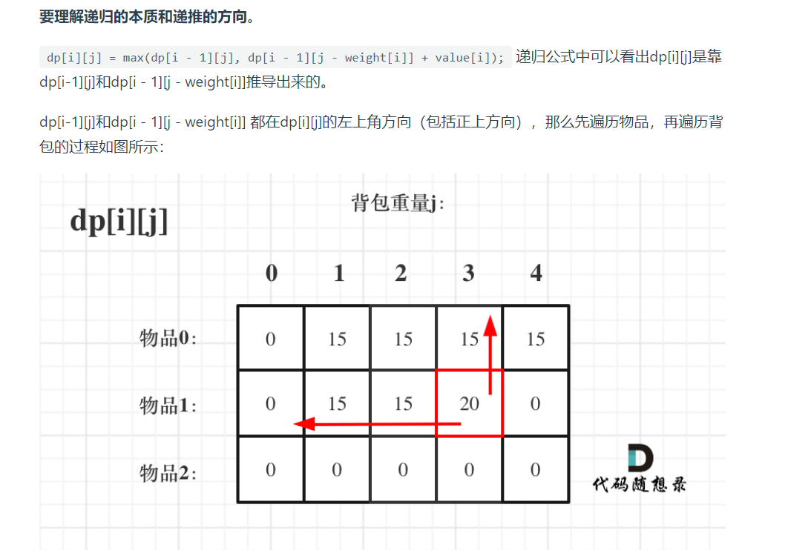

# 0/1背包
每个物品只用1次

二维 i j遍历顺序可颠倒

一维dp数组遍历顺序
代码如下：
```
for(int i = 0; i < weight.size(); i++) { // 遍历物品
for(int j = bagWeight; j >= weight[i]; j--) { // 遍历背包容量
dp[j] = max(dp[j], dp[j - weight[i]] + value[i]);

    }
}
```
注意：那么问题又来了，为什么二维dp数组遍历的时候不用倒序呢？

因为对于二维dp，dp[i][j]都是通过上一层即dp[i - 1][j]计算而来，本层的dp[i][j]并不会被覆盖！

（如何这里读不懂，大家就要动手试一试了，空想还是不靠谱的，实践出真知！）

再来看看两个嵌套for循环的顺序，代码中是先遍历物品嵌套遍历背包容量，那可不可以先遍历背包容量嵌套遍历物品呢？
不可以！
因为一维dp的写法，背包容量一定是要倒序遍历（原因上面已经讲了），如果遍历背包容量放在上一层，那么每个dp[j]就只会放入一个物品，即：背包里只放入了一个物品。