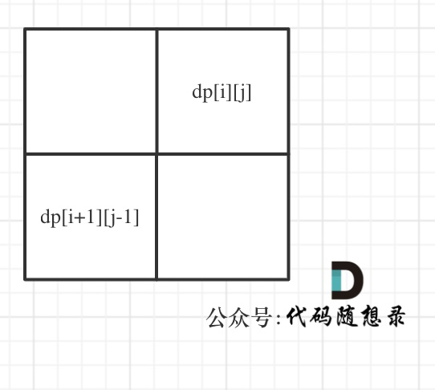

## 回文子串
dp的含义不同 不是问啥求啥 布尔类型的dp[i][j]：表示区间范围[i,j] （注意是左闭右闭）的子串是否是回文子串，如果是dp[i][j]为true，否则为false。

确定递推公式
在确定递推公式时，就要分析如下几种情况。

整体上是两种，就是s[i]与s[j]相等，s[i]与s[j]不相等这两种。

当s[i]与s[j]不相等，那没啥好说的了，dp[i][j]一定是false。

当s[i]与s[j]相等时，这就复杂一些了，有如下三种情况

情况一：下标i 与 j相同，同一个字符例如a，当然是回文子串
情况二：下标i 与 j相差为1，例如aa，也是回文子串
情况三：下标：i 与 j相差大于1的时候，例如cabac，此时s[i]与s[j]已经相同了，我们看i到j区间是不是回文子串就看aba是不是回文就可以了，那么aba的区间就是 i+1 与 j-1区间，这个区间是不是回文就看dp[i + 1][j - 1]是否为true。
以上三种情况分析完了，那么递归公式如下：
```
if (s[i] == s[j]) {
if (j - i <= 1) { // 情况一 和 情况二
result++;
dp[i][j] = true;
} else if (dp[i + 1][j - 1]) { // 情况三
result++;
dp[i][j] = true;
}
}
result就是统计回文子串的数量。

```

遍历顺序
所以一定要从下到上，从左到右遍历，这样保证dp[i + 1][j - 1]都是经过计算的。

有的代码实现是优先遍历列，然后遍历行，其实也是一个道理，都是为了保证dp[i + 1][j - 1]都是经过计算的。

```
for (int i = len - 1; i >= 0; i--) {
            for (int j = i; j < len; j++) {
                if (chars[i] == chars[j]) {
                    if (j - i <= 1) { // 情况一 和 情况二
                        result++;
                        dp[i][j] = true;
                    } else if (dp[i + 1][j - 1]) { //情况三
                        result++;
                        dp[i][j] = true;
                    }
                }
            }
        }

```
## 回文子序列


dp[i][j]：字符串s在[i, j]范围内最长的回文子序列的长度为dp[i][j]。

dp数组如何初始化
首先要考虑当i 和j 相同的情况，从递推公式：dp[i][j] = dp[i + 1][j - 1] + 2; 可以看出 递推公式是计算不到 i 和j相同时候的情况。

所以需要手动初始化一下，当i与j相同，那么dp[i][j]一定是等于1的，即：一个字符的回文子序列长度就是1。

其他情况dp[i][j]初始为0就行，这样递推公式：dp[i][j] = max(dp[i + 1][j], dp[i][j - 1]); 中dp[i][j]才不会被初始值覆盖。

vector<vector<int>> dp(s.size(), vector<int>(s.size(), 0));
for (int i = 0; i < s.size(); i++) dp[i][i] = 1;
确定遍历顺序
从递归公式中，可以看出，dp[i][j] 依赖于 dp[i + 1][j - 1] ，dp[i + 1][j] 和 dp[i][j - 1]，如图：


所以遍历i的时候一定要从下到上遍历，这样才能保证下一行的数据是经过计算的。